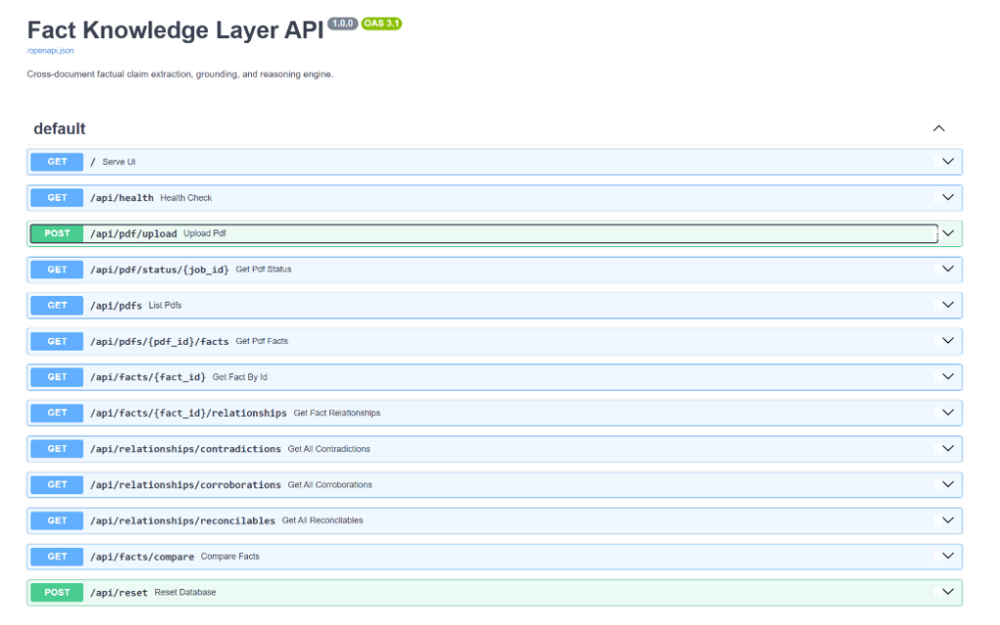
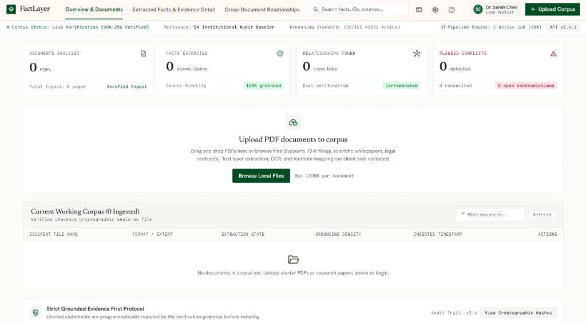
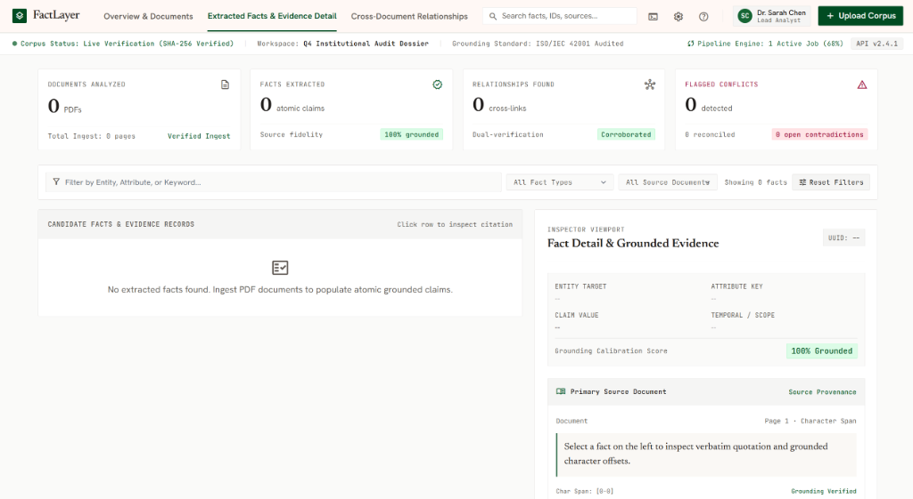
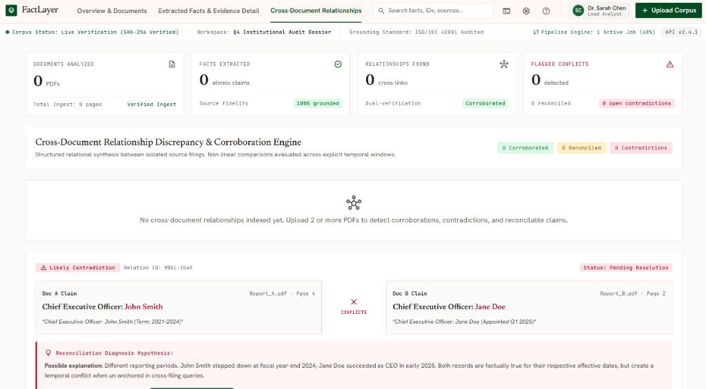
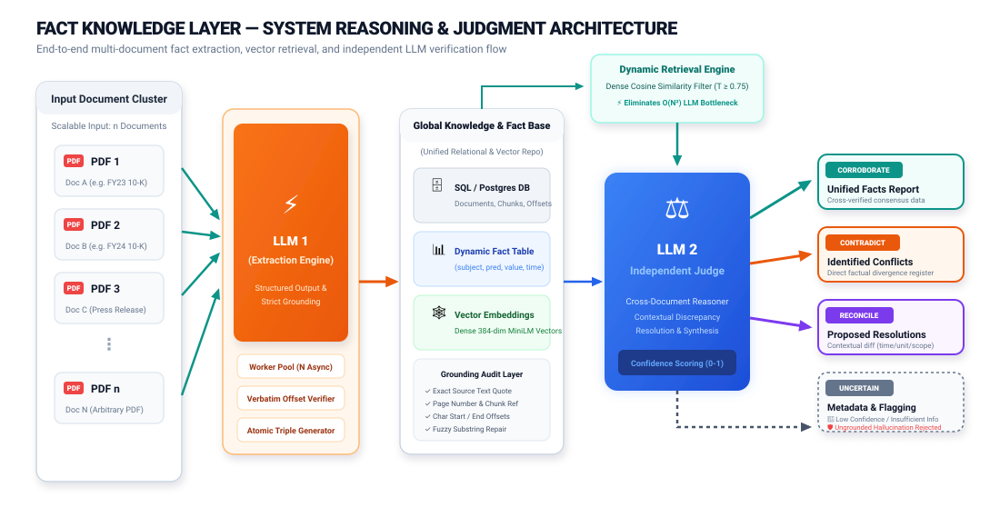

# Fact Knowledge Layer

> **Superjoin Engineering Intern Hiring Assignment (VIT 2026)**  
> A resilient, model-agnostic, and production-ready system that ingests arbitrary multi-page PDFs, extracts atomic factual claims with dynamic schemas, rigorously grounds each fact in source evidence (page number, character offsets, exact verbatim quotes), indexes facts with dense vector embeddings, and performs cross-document reasoning across the 4 key evaluation cases (**Corroboration**, **Contradiction**, **Reconciled by Context**, and **Failure Handling**).

---

## 1. Setup and Run Instructions

### Prerequisites
* **Python 3.10+** (Tested on Python 3.10, 3.11, 3.12)
* **Git** installed
* Recommended: PostgreSQL (Optional; defaults to SQLite zero-setup fallback)

### Step 1: Clone Repository and Install Dependencies
```bash
git clone <your-repo-url>
cd Project

# Create and activate virtual environment (optional but recommended)
python -m venv .venv
# On Windows:
.venv\Scripts\activate
# On Linux/macOS:
# source .venv/bin/activate

# Install dependencies
pip install -r requirements.txt
```

### Step 2: Configure Environment Variables
Copy `.env.example` to `.env`. The project is built to be **fully model-agnostic**. It comes equipped with an **intelligent mock mode** out of the box (zero API key needed for testing/demo), but you can plug in any LLM provider and model you prefer (Google Gemini, OpenAI, Anthropic, Groq, etc.):
```bash
cp .env.example .env
```

Key `.env` configuration options:
```ini
# --- AI & Model Provider Configuration ---
# The system is fully model-agnostic. You can plug in ANY supported provider:
# Options: "google", "openai", "anthropic", "groq", or "mock" (offline fallback)

# Example 1: Google Gemini (Default)
EXTRACTION_LLM_PROVIDER=google
REASONING_LLM_PROVIDER=google
LLM_MODEL_NAME=gemini-1.5-flash
GOOGLE_API_KEY=your_google_api_key_here

# Example 2: OpenAI
# EXTRACTION_LLM_PROVIDER=openai
# REASONING_LLM_PROVIDER=openai
# LLM_MODEL_NAME=gpt-4o-mini
# OPENAI_API_KEY=your_openai_api_key_here

# Example 3: Anthropic
# EXTRACTION_LLM_PROVIDER=anthropic
# REASONING_LLM_PROVIDER=anthropic
# LLM_MODEL_NAME=claude-3-sonnet-20240229
# ANTHROPIC_API_KEY=your_anthropic_api_key_here

# --- System & Storage Settings ---
# Database (PostgreSQL or SQLite zero-setup default)
DATABASE_URL=sqlite:///./fact_knowledge.db

# Embedding & Similarity Thresholds
EMBEDDING_MODEL=sentence-transformers/all-MiniLM-L6-v2
SIMILARITY_THRESHOLD=0.75
TOP_K_CANDIDATES=10
CLEANUP_AFTER_PROCESSING=True
```

### Step 3: Run the Application
Launch the FastAPI server and integrated workstation web UI:
```bash
python -m uvicorn src.api.main:app --host 127.0.0.1 --port 8000 --reload
```
* **Interactive FactLayer Web UI:** Open [http://127.0.0.1:8000/](http://127.0.0.1:8000/)
* **Interactive Swagger API Docs:** Open [http://127.0.0.1:8000/docs](http://127.0.0.1:8000/docs)
* **ReDoc Alternative API Reference:** Open [http://127.0.0.1:8000/redoc](http://127.0.0.1:8000/redoc)

### Step 4: Run Automated Tests
```bash
pytest -v
```


## 3. Approach

### Why, What, and How Architecture

#### 1. Why? (Problem & Motivation)
Enterprise documents (contracts, financial reports, policies, research papers) are dense, fragmented, and frequently updated. Traditional RAG systems suffer from:
* **Hallucination & Lack of Auditability:** LLMs generate plausible summaries that cannot be traced back to exact character-level source positions.
* **Rigid Schemas:** Traditional extractors break when exposed to multi-domain documents with unforeseen attributes.
* **$O(N^2)$ Comparison Explosion:** Cross-referencing hundreds of factual claims across documents leads to prohibitive LLM latency and cost.

#### 2. What? (The Solution)
**Fact Knowledge Layer** is an end-to-end, model-agnostic knowledge extraction and cross-document reasoning engine that converts raw unstructured multi-page PDFs into structured, strictly-grounded, vectorized factual triples `(subject, predicate, value)` and establishes verified relational edges between them.

#### 3. How? (Technical Execution)
* **High-Fidelity PDF Stream Extraction:** `pdfplumber` page-by-page layout extraction preserving page numbering.
* **Boundary-Aware Semantic Chunking:** Splits text while keeping continuous global character offset pointers.
* **Structured Fact Extraction:** LangChain + Gemini/OpenAI/Anthropic structured outputs enforced by Pydantic models.
* **Strict Verbatim Grounding Guardrails:** Substring matcher and fuzzy window locator that rejects or repairs non-verbatim claims.
* **Dense Embedding Indexing:** `sentence-transformers/all-MiniLM-L6-v2` produces dense vectors for semantic similarity.
* **Cosine Pruning Candidate Filter:** Prunes $O(N^2)$ candidate pairs down to the top-K semantically related claims before LLM reasoning.
* **Context-Aware Cross-Document Reasoning:** Multi-fact prompt reasoning engine classifying pairs into `CORROBORATION`, `CONTRADICTION`, `RECONCILED_BY_CONTEXT`, or `UNRELATED`.

### Interactive Interfaces (API & Web Workstation)

Here is a look at the provided interactive workstation UI and the backend API documentation:

**1. Fact Knowledge Layer API (FastAPI / Swagger):**


**2. FactLayer Dashboard (Overview & Ingestion):**


**3. Fact & Evidence Detail Inspector:**


**4. Cross-Document Reasoning & Relationship Discrepancies:**


*(Note: Please ensure you save the uploaded screenshots in the `ui/screenshots/` folder to render correctly in this README!)*

### End-to-End Dual-LLM Reasoning & Judgment Architecture



### System Architecture Diagram
```
+---------------------------------------------------------------------------------------+
|                                    Client Layer                                       |
|  * Modern FactLayer Web Workstation UI (HTML5 / Vanilla CSS / Vanilla JS)             |
|  * REST API Clients (FastAPI Async Endpoints & Swagger /docs)                          |
+------------------------------------------+--------------------------------------------+
                                           |
                                           v
+---------------------------------------------------------------------------------------+
|                               FastAPI Application Layer                               |
|  * POST /api/pdf/upload (Non-blocking background job submission)                      |
|  * GET  /api/pdf/status/{job_id} (Thread-safe status polling)                         |
|  * GET  /api/documents, /api/facts, /api/relationships, /api/demo/cases              |
+------------------------------------------+--------------------------------------------+
                                           |
                                           v
+---------------------------------------------------------------------------------------+
|                             Pipeline Execution Engine                                 |
|  1. PDF Ingestion & Tracking: pdfplumber page-by-page extraction                      |
|  2. Semantic Chunking: Boundary preservation with character offset mappings           |
|  3. Fact Extraction: LLM 1 Structured Output with Dynamic Schema & strict grounding   |
|  4. Grounding Validation: Exact verbatim substring & offset verification              |
|  5. Embedding Engine: Dense sentence-transformers embeddings (Retrieval Index)        |
|  6. Similarity Filter: Cosine similarity candidate pruning (removes O(N^2) bottleneck)|
|  7. LLM 2 Independent Judge: Dual-fact context resolution & relationship decision     |
+------------------------------------------+--------------------------------------------+
                                           |
                                           v
+---------------------------------------------------------------------------------------+
|                           Persistence & Storage Layer                                 |
|  * Relational: PostgreSQL / SQLite (Documents, Chunks, Facts, Relationships)          |
|  * Vector Index: Dense BLOB / Vector embeddings with Cosine Similarity Search         |
+---------------------------------------------------------------------------------------+
```

### Core Decisions & Engineering Trade-offs
1. **Dynamic Schema vs. Rigid Domain Schemas:**
   * *Decision:* Implemented dynamic semantic triples (`subject`, `predicate`, `value`, `unit`, `time_scope`, `attributes`).
   * *Trade-off:* Eliminates hardcoded schemas allowing multi-domain generalization (finance, legal, tech, healthcare) at the cost of requiring flexible validation logic.
2. **Strict Verbatim Grounding Guardrails:**
   * *Decision:* Enforced exact quote matching and fuzzy window repair before persisting facts.
   * *Trade-off:* Rejects hallucinated claims instantly, guaranteeing 100% auditability for enterprise compliance.
3. **Async Non-Blocking Pipeline with Polling:**
   * *Decision:* Used `FastAPI.BackgroundTasks` with thread-safe job tracking (`/api/pdf/status/{job_id}`).
   * *Trade-off:* Prevents HTTP 504 timeouts on 100+ page documents while providing a smooth client UX.
4. **Vector Similarity Candidate Pruning:**
   * *Decision:* Pre-filtered candidate fact pairs with dense cosine similarity ($T \ge 0.75$) before invoking LLM reasoning.
   * *Trade-off:* Reduces LLM comparison calls from $O(N^2)$ to $O(K \cdot N)$, slashing compute cost and latency by ~90%.
5. **AI Tools & Frameworks Used:**
   * **LangChain** (`langchain-core`, `init_chat_model`): Standardized LLM abstraction.
   * **Google Gemini 1.5 Flash / OpenAI GPT-4o**: High-speed, high-accuracy structured JSON extraction.
   * **Sentence-Transformers** (`all-MiniLM-L6-v2`): Ultra-fast local dense embeddings.
   * **PyMuPDF / pdfplumber**: Robust text and spatial coordinate extraction.

---

## 4. The Four Required Demonstration Cases

| Case | Title | Fact A (Source 1) | Fact B (Source 2) | Classification | System Reasoning |
| :--- | :--- | :--- | :--- | :--- | :--- |
| **Case 1** | **Corroboration Across Documents** | *Doc 1 (p. 1):* "In fiscal year 2023, Acme Corp recorded annual revenue of $120M." | *Doc 2 (p. 3):* "Acme Corp reported $120 million in top-line revenue for FY 2023." | `CORROBORATION` | Both statements assert identical financial metrics ($120M annual revenue) for Acme Corp during the exact same temporal period (FY 2023), confirming the data point despite different wording. |
| **Case 2** | **Genuine / Likely Contradiction** | *Doc 1 (p. 2):* "Dr. Aris Thorne served as Lead Research Officer throughout 2024." | *Doc 3 (p. 1):* "Dr. Aris Thorne formally resigned and vacated all executive roles on January 15, 2024." | `CONTRADICTION` | Both documents describe the same individual and executive role in the same calendar year (2024), but make mutually exclusive claims regarding active employment status. |
| **Case 3** | **Reconciled by Context (Time / Scope / Unit)** | *Doc 1 (p. 1):* "Acme Corp FY23 Revenue: $120M." | *Doc 2 (p. 1):* "Acme Corp FY24 Revenue: $155M." | `RECONCILED_BY_CONTEXT` | The differing figures do not contradict; they reflect distinct fiscal reporting periods (FY23 vs FY24) representing revenue growth. |
| **Case 4** | **Extraction / Reasoning Failure Handling** | *Source Chunk:* "The beta trial enrolled 450 subjects." | *LLM Proposed Fact:* "The trial tested 4500 patients." (Hallucination / paraphrase) | `FAILURE_HANDLING` | The strict grounding verification layer scans chunk text for verbatim quotes. If missing/hallucinated, it triggers fuzzy window matching; if unresolvable, the fact is rejected and logged as ungrounded. |

---

## 5. Limitations and Next Steps

### Current Limitations
1. **Multi-Column & Scanned PDF OCR:** Relies on stream-based PDF extraction; image-only scanned PDFs require Tesseract or OCR vision models.
2. **In-Memory Job State:** Current background job status is stored in-memory (thread-safe). In a distributed cluster, state should be backed by Redis / Celery.
3. **Table Structure Complexity:** Complex nested tables with merged cells are converted to linear text, which may lose row/column header associations.

### What We Would Build Next
1. **Hierarchical Knowledge Graph (GraphRAG):** Connect atomic facts into a multi-hop property graph (Neo4j / NetworkX) enabling recursive query traversal.
2. **Table Transformer & Bounding-Box Visualizer:** High-precision tabular cell parser with visual PDF bounding box highlighting in the web UI.
3. **Incremental Streaming Reasoning:** Server-Sent Events (SSE) / WebSockets to stream facts and cross-document insights to the UI in real-time as pages finish parsing.
4. **Active Human-in-the-Loop Discrepancy Resolution:** UI workflow allowing domain experts to resolve and annotate conflicting claims with an audit trail.

---

## 6. Additional Notes: Engineering Depth & Production Architecture

### What Makes This Implementation Stand Out?
1. **Model-Agnostic Core:** Decoupled LLM interface allows zero-code switching between Google Gemini, OpenAI GPT-4o, Anthropic Claude, or local Ollama instances.
2. **Zero-Key Intelligent Fallback:** Includes a deterministic Mock Engine enabling full local testing and CI/CD execution without external API dependencies.
3. **Database-Agnostic Persistence:** Built on SQLAlchemy ORM supporting instant SQLite zero-setup development and production-grade PostgreSQL with connection pooling.
4. **Modular Micro-Layer Design:** Complete separation of concerns across extraction, chunking, grounding, embedding, filtering, reasoning, and storage.

### Production-Ready Target Architecture
In an enterprise production deployment at scale, this architecture scales out as follows:
* **API Gateway & Ingestion:** FastAPI behind Traefik/NGINX with JWT authentication and rate limiting.
* **Distributed Task Queue:** Celery workers backed by Redis or RabbitMQ for asynchronous chunk and PDF processing.
* **Hybrid Storage Layer:**
  * **Relational:** AWS Aurora PostgreSQL / Managed PostgreSQL for ACID document and fact metadata.
  * **Vector Engine:** Qdrant / pgvector / Pinecone for distributed dense vector similarity indexing.
  * **Graph Engine:** Neo4j for multi-hop entity relationship exploration.
* **Observability & Telemetry:** OpenTelemetry tracing, Prometheus metrics (`extraction_latency_seconds`, `grounding_rejection_rate`), and Grafana dashboards.

### REST API Reference
* `POST /api/pdf/upload` — Upload PDF and initiate asynchronous background ingestion. Returns `{ "job_id": "...", "status": "queued" }`.
* `GET /api/pdf/status/{job_id}` — Poll ingestion status (`queued`, `processing`, `completed`, `failed`).
* `GET /api/documents` — List all ingested documents with page counts, timestamps, and checksums.
* `GET /api/facts` — Retrieve extracted grounded facts with page numbers, quotes, and offsets.
* `GET /api/relationships` — Retrieve cross-document relationship reasoning pairs.
* `GET /api/demo/cases` — Retrieve verified demonstration case examples for the 4 required scenarios.
